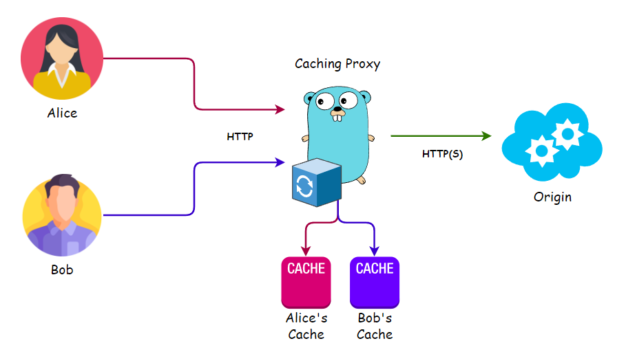

## 🔄 Caching Proxy

A fully functional and self-contained caching proxy, ready to use with minimal setup.
Download the pre-built executable for your architecture or build it yourself using a Docker container.

A solution for [Roadmap.sh - Caching Proxy](https://roadmap.sh/projects/caching-server).



## ⭐ Key Features:

- **No external dependencies!**
- Caches data to disk, allowing you to specify a custom cache directory, reducing memory usage.
- Can cache responses uniquely for each user based on their cookies and user agent.
- Manual cache clearing available.
- Adds `X-Cache: HIT` or `X-Cache: MISS` headers to responses, indicating whether the response is served from the cache or fetched from the server.
- Automatically purges outdated cache entries with customizable expiration times.
- Only caches safe HTTP methods (`GET`, `HEAD`, `OPTIONS`), ensuring the normal operation of your site is not disrupted.

## 🤔 Usage

For example, to run the proxy on port 3000 and forward requests to https://github.com/, use the following command:

```shell
caching-proxy --port 3000 --origin https://github.com/
```

Detailed usage instructions:

    Usage: caching-proxy --port <number> --origin <url> [options]
    
    Required:
    --port <number>          Port on which the caching proxy server will run.
    --origin <url>           URL of the server to which the requests will be forwarded.
    
    Options:
    --host <string>          Host on which the caching proxy server will run. (default: 0.0.0.0)
    --unique                 Generate unique cache per user (based on User-Agent or cookies). (default: false)
    --cache-timeout <time>   Duration to keep cached responses before expiration (e.g., 10s, 5m, 1h). (default: none)
    --cache-folder <string>  Directory to cache proxy server in. (default: "./cache")
    --clear-cache            Clear the cache of proxy server and exit.
    -h, --help               Show this help message.


## 🏗 Build

🐳 Docker image:

```shell
docker build -t caching-proxy:0.1 .
```

✍ From Source:

```shell
CGO_ENABLED=0 go build -o caching-proxy ./cmd/main.go
```

## ⚡ Multi-architecture Build

Build for multiple architectures from source. The resulting archives can be found in the `release` directory.

```shell
sudo bash ./build-releases.sh
```
